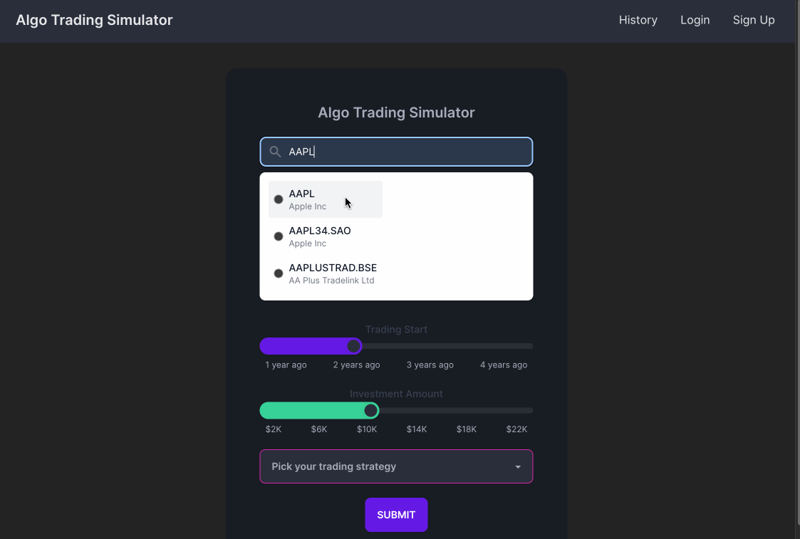

# Algo Trading What-If Simulator

## Description

This application is a what-if simulator for stock trading. It allows users to simulate trades on stocks and see how they would have performed in the past. The application uses the [Alpha Vantage API](https://www.alphavantage.co/) to get stock data and the [MongoDB Atlas](https://www.mongodb.com/cloud/atlas) cloud database to store user data. The application uses [React](https://reactjs.org/) for the front end and [GraphQL](https://graphql.org/) for the back end. The application uses [Apollo Server](https://www.apollographql.com/docs/apollo-server/) for the GraphQL server and [Apollo Client](https://www.apollographql.com/docs/react/) for the GraphQL client. The application uses [JWT](https://jwt.io/) for user authentication. [Victory Charts](https://formidable.com/open-source/victory/) is used for rendering line charts of historical stock data and [Tailwind CSS](https://tailwindcss.com/) is used for styling.

## Table of Contents

* [Usage](#usage)
* [License](#license)
* [Contributing](#contributing)
* [Questions](#questions)

## Usage

To use this application, go to the [deployed application](https://algo-trading-simulator.herokuapp.com/). You can search for a stock, set the time period, investment amount, and trading algorithm to analyze potential strategies. You can also create an account to save your strategies and view your past what-if scenarios.

Gif of application in use:

## License

This project is licensed under the MIT license.

## Contributing

To contribute to this project, fork the repository and submit a pull request.

## Questions

If you have any questions about this project, please contact me via [email](mailto:mccoy.did@gmail.com) or [GitHub](https://github.com/mccoydidericksen).